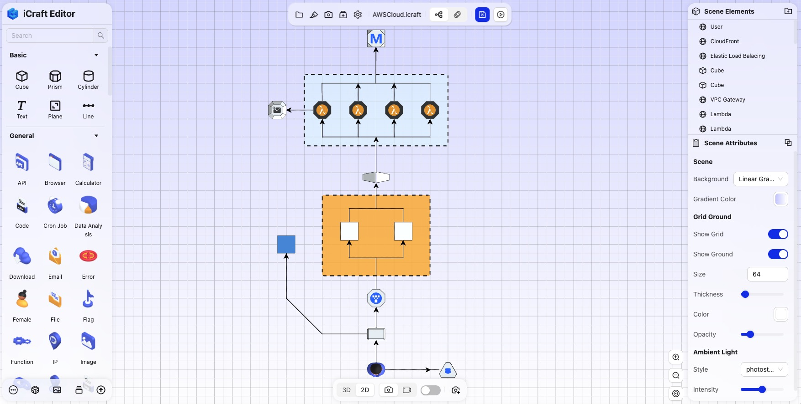
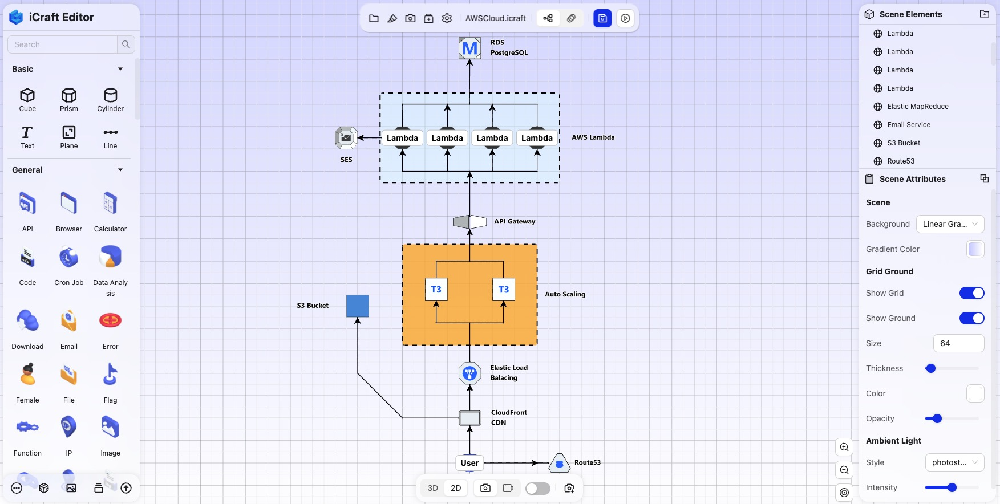
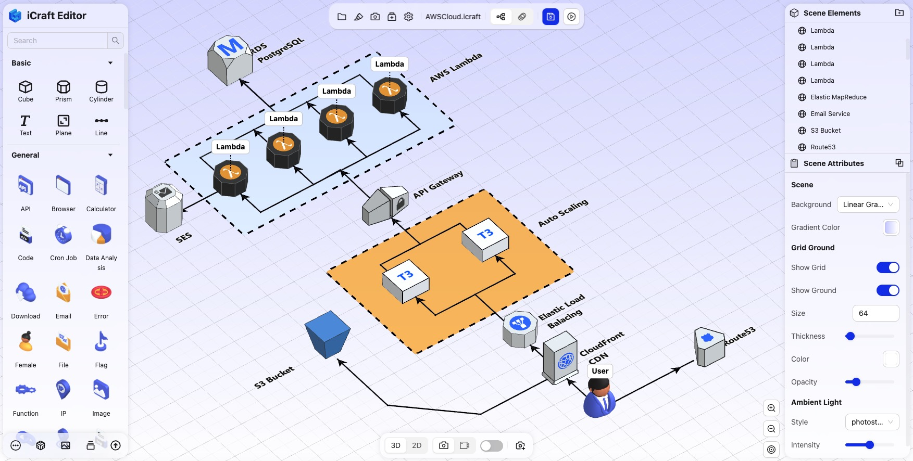
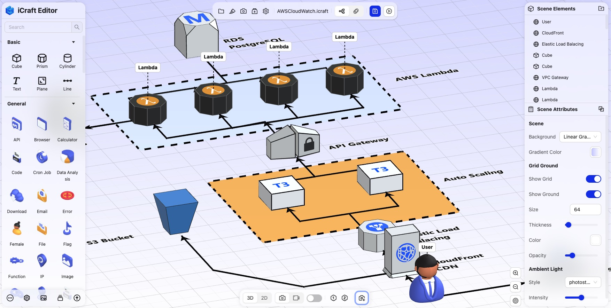

<!--
 * @Descripttion: 
 * @MainAuthor: 
-->
# How to Transform a 2D Architecture Diagram into a 3D Diagram

A 2D architecture diagram is a simple and intuitive way to represent the system's functions, subsystems, and component hierarchy in a two-dimensional chart. However, as systems evolve, the limitations of 2D diagrams become more apparent. For example, when the system’s functions, subsystems, and components become complex and branching, 2D diagrams can no longer effectively visualize the system architecture.

To overcome the limitations of 2D diagrams, 3D architecture diagrams have emerged. A 3D architecture diagram represents the system’s functions, subsystems, and component hierarchy in a spatial format, making it easier to visualize the architecture and better reflect the complexity of the system.

## Steps to Convert a 2D Architecture Diagram to a 3D Diagram

#### 1. Open the iCraft Editor software, create a new file, and press the "V" keyboard shortcut to switch to a 2D top-down view, as shown below.

#### 2. First, draw the functional blocks of the system from the top-down view. In iCraft Editor, you can draw blocks just like you would in a 2D graphics software. As shown below, draw the Auto Scaling and AWS Lambda blocks using flat elements.

#### 3. Next, add the necessary elements and drag them to the corresponding positions.

#### 4. Connect the elements based on their relationships.

#### 5. Begin adding annotation text to describe the function of each area or element and explain the connections between them. At this point, you can optionally enable the hover text feature to display tooltips for the elements.

At this stage, the 2D architecture diagram is completed just like using 2D graphics software.

#### 6. Finally, press the "V" keyboard shortcut to switch the view to an isometric 3D view. You will now see the 2D architecture diagram transformed into a spatial 3D architecture diagram.

#### 7. You can hold "Alt" and the left mouse button to rotate the view, allowing you to observe and explain the system architecture from different angles.

#### 8. By adding camera buttons, you can save the current camera view, and with the numeric keys on your keyboard, you can switch between saved camera views, allowing for quick transitions to different perspectives when explaining the system architecture.

## Recommended: Use iCraft Editor
As you can see, the steps to create a 3D architecture diagram are almost identical to creating a 2D one, with the difference being the use of iCraft Editor. iCraft Editor is currently the only software in the world that can draw true 3D architecture diagrams. With 3D architecture diagrams, you can more intuitively represent system architectures and better reflect their complexity.

iCraft Editor website: [https://icraft.gantcloud.com](https://icraft.gantcloud.com)