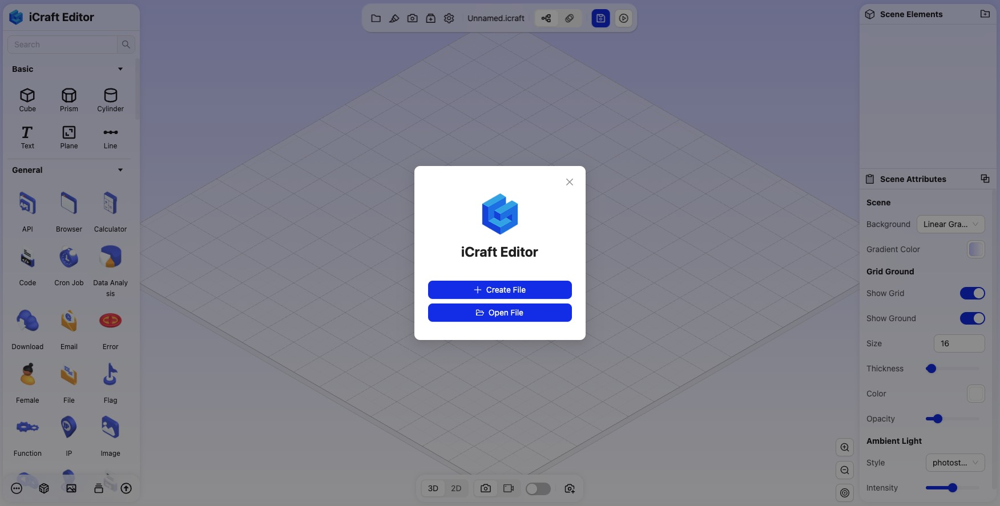
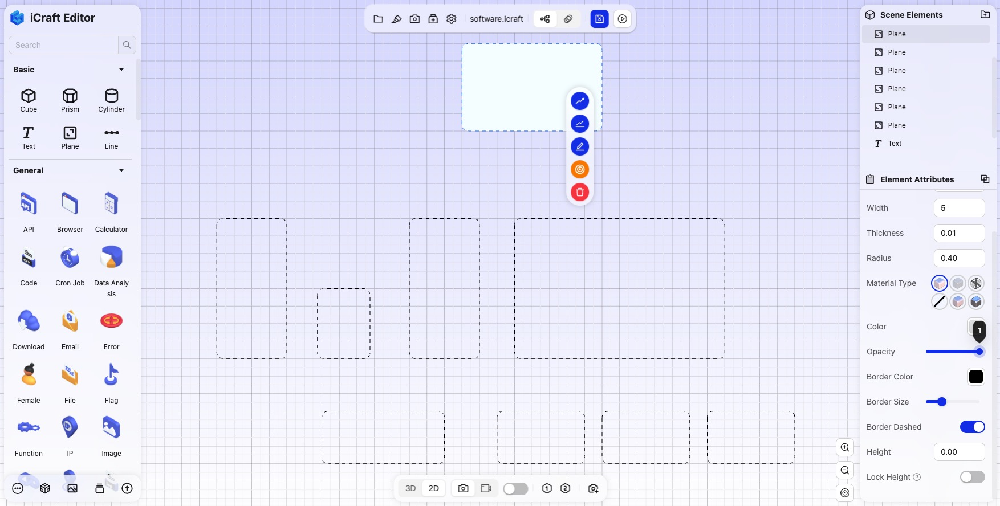
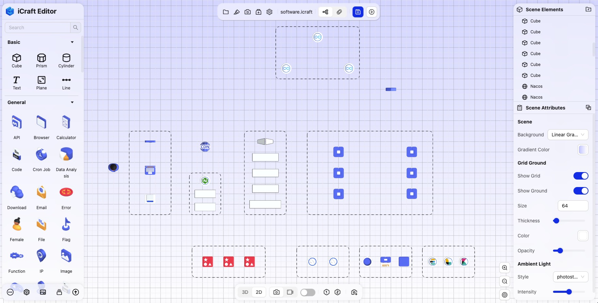
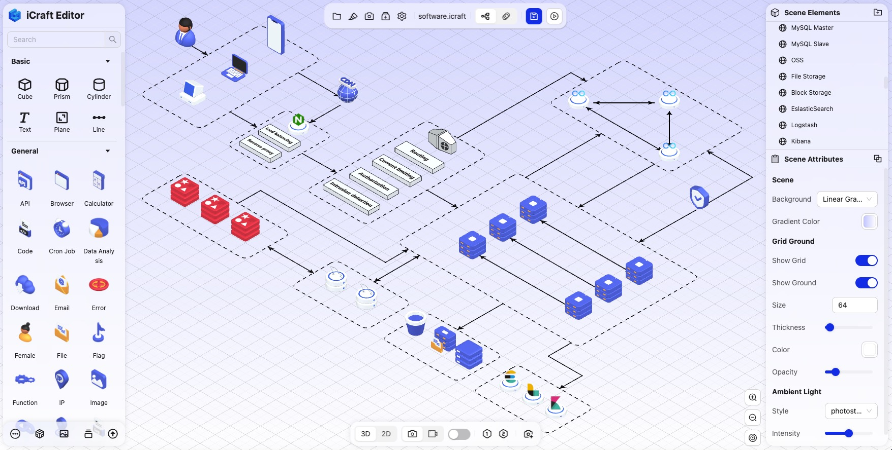
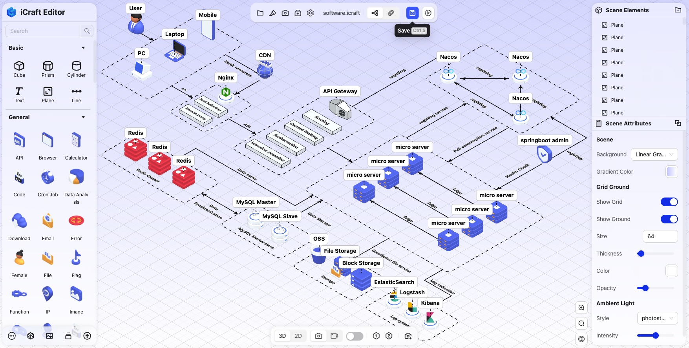

# How to Create a 3D System Architecture Diagram

A 3D system architecture diagram uses three-dimensional space to display system architectures. It provides an intuitive way to visualize the components, modules, and services of complex software and hardware systems, as well as their relationships and interactions. Compared to traditional 2D architecture diagrams, 3D diagrams offer a more comprehensive view of hierarchical information and structure, making them easier to understand and analyze.

## Advantages of a 3D System Architecture Diagram

#### 1. Clearer Hierarchical Relationships:
By utilizing three-dimensional space, different system layers can be displayed, such as the frontend, middleware, and backend. This also allows for the nesting and dependencies between services and modules to be visualized more effectively, giving a stronger sense of structure and avoiding the clutter found in 2D diagrams.

#### 2. More Intuitive Interactive Experience:
3D architecture diagrams support actions like rotation, zoom, and drag, allowing users to interactively view the architecture from different angles and focus on specific parts of interest. This flexible interaction helps users better understand the system architecture.

#### 3. Richer Information Visualization:
In a 3D space, more dimensions of information can be displayed. Besides basic structural relationships, properties such as color, size, shape, and transparency can be used to represent system status, performance, load, and more.

#### 4. Suitable for Complex Systems:
For large distributed systems, microservice architectures, or multi-layer network architectures, 2D diagrams might struggle to clearly show complex dependencies and relationships. In contrast, 3D diagrams can effectively address this problem.

#### 5. Enhances Team Communication and Collaboration:
3D architecture diagrams can serve as a more intuitive common language for teams, especially in cross-departmental and cross-disciplinary teams. They help developers, architects, product managers, and other stakeholders achieve a unified understanding of the system, improving communication efficiency.

#### 6. Dynamic Simulation and Presentation:
3D architecture diagrams can be combined with dynamic simulations to demonstrate how a system works, the flow of requests, and can even display real-time system performance data and status, making them ideal for technical presentations and decision-making analysis.

3D system architecture diagrams are particularly suited for scenarios where complex interactions between multiple systems and modules need to be visualized, such as microservice architectures, large distributed systems, or cloud infrastructure.

## A Step-by-Step Example of Creating a 3D System Architecture Diagram

#### 1. Open iCraft Editor and click to create a new file.

#### 2. Press the V shortcut to switch to top view. Find the flat element in the left panel and drag it onto the canvas to divide large areas. Adjust the flat element's properties, such as fill color, fill transparency, border color, border thickness, and dashed borders as needed.

#### 3. In the components panel on the left, find the required components, such as databases, servers, middleware, etc., and drag them to their specific positions on the canvas. Special components can be represented by basic elements with text annotations.

#### 4. Connect the elements based on their relationships, such as network connections between databases and servers, or API calls between middleware and servers.

#### 5. Adjust the position, size, color, and other properties of the elements until you achieve the desired result.

#### 6. Add annotation text to describe the functions and roles of the elements.

#### 7. Click the preview button to demonstrate the diagram, allowing others to intuitively understand the system architecture. You can hold Alt + left mouse button to rotate and view the architecture from different angles.

#### 8. Finally, save the file and share it with others.

## Recommended: iCraft Editor
You can use free iCraft Editor templates to create 3D system architecture diagrams, making it easier and faster than ever to create 3D diagrams.

iCraft Editor Official Website: [https://icraft.gantcloud.com](https://icraft.gantcloud.com)