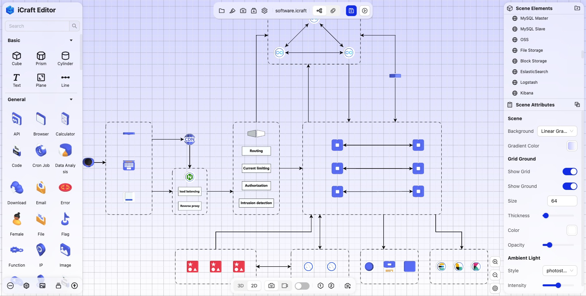
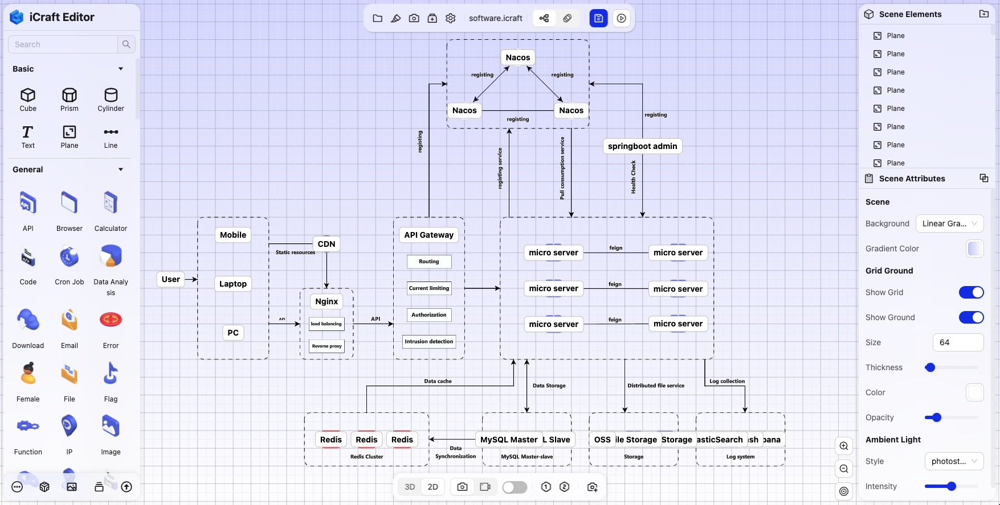
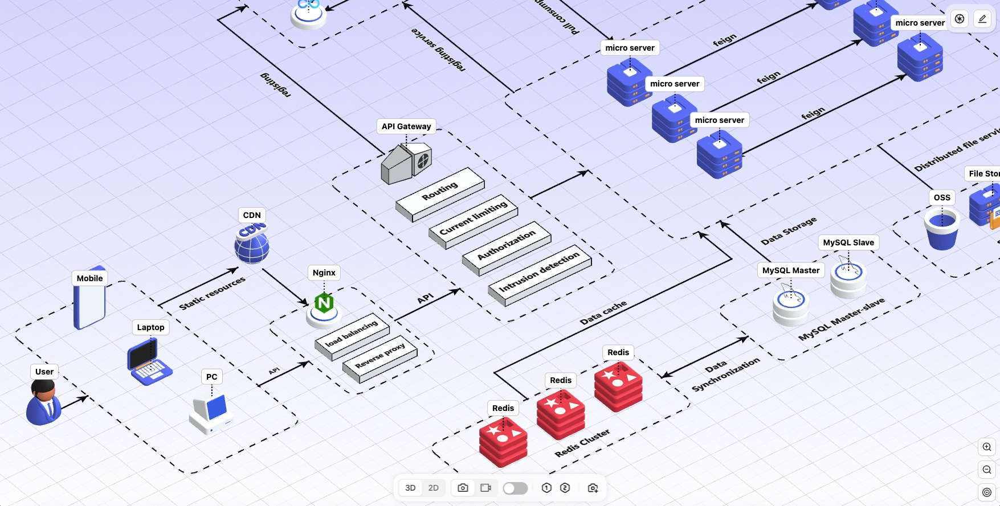

<!--
 * @Descripttion: 
 * @MainAuthor: 
-->

# 如何绘制3D系统架构图

3D系统架构图是一种使用三维空间展示系统架构的方式，它可以用来直观地展示复杂的软件、硬件系统的组件、模块、服务之间的关系和交互方式。相比传统的2D架构图，3D系统架构图能够更全面地展示信息层次和结构，使得理解和分析变得更加直观。

## 3D系统架构图的优势

#### 1.	更清晰的层次关系：
通过三维空间可以展示系统的不同层次，例如前端、中间层、后端，或者展示不同服务、模块之间的嵌套和依赖关系，层次感强，避免了2D架构图中的拥挤感。
#### 2.	更直观的交互体验：
3D架构图支持旋转、缩放、拖拽等操作，用户可以通过交互的方式查看架构的不同角度，聚焦于感兴趣的部分。这种灵活的交互方式能够帮助用户更好地理解系统架构。
#### 3.	信息可视化更丰富：
3D空间能展示更多维度的信息，除了基本的结构关系，还可以通过不同的颜色、大小、形状、透明度等属性来表示系统的状态、性能、负载等信息。
#### 4.	适合展示复杂的系统：
在面对大型分布式系统、微服务架构、多层次网络架构时，2D图可能无法清晰地展示复杂的依赖和关系，而3D图可以有效解决这一问题。
#### 5.	增强团队沟通和协作：
3D架构图能够为团队提供一个更直观的共同语言，尤其是在跨部门、跨专业的团队中，它有助于开发者、架构师、产品经理等角色对系统的统一理解，从而提高沟通效率。
#### 6.	动态模拟和演示：
3D架构图可以与动态模拟结合，用于演示系统的工作流程、请求的流动方向，甚至可以实时展示系统中的性能数据和状态，适合用于技术演示和决策分析。

3D系统架构图可以特别适合那些需要展示多个系统、模块间复杂交互的场景，例如微服务架构、大型分布式系统、云计算基础设施等领域。

## 以一个实际的3D系统架构图为例，演示如何绘制3D系统架构图

#### 1. 打开iCraft Editor，点击新建文件。

#### 2. 按快捷键V切换为俯视图，在左侧面板中找到平面元素，拖拽到画布上，划分出大区块，根据需要可以调整平面的效果，如填充颜色、填充透明度、边框颜色、边框粗细、边框虚线等。

   
#### 3. 在左侧的组件面板中，找到所需的组件，如数据库、服务器、中间件等，并将其拖拽到画布具体的位置上。一些特殊的组件可以用基本元素加文字的方式来表示。

#### 4. 根据元素之间的关系来连接元素，如数据库和服务器之间通过网络连接，中间件和服务器之间通过API调用。

#### 5. 调整元素的位置、大小、颜色等属性，直到达到你想要的效果。

#### 6. 添加注解文字，描述元素的功能和作用。

#### 7. 演示效果，让其他人能够直观地理解系统架构,我们可以按住Alt+鼠标左键进行旋转,可以从不同的角度观察、解说系统的架构。

#### 8. 保存文件，并分享给其他人。

## 推荐使用iCraft Editor
可以使用免费的iCraft Editor模板创建3D系统架构图，创建3D系统架构图从未如此简单快捷。

iCraft Editor 官网：https://icraft.gantcloud.com