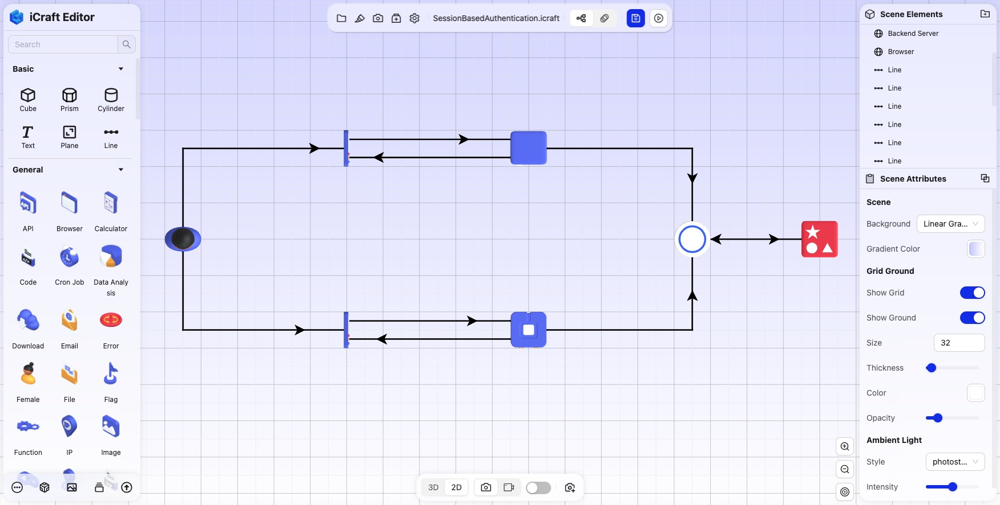
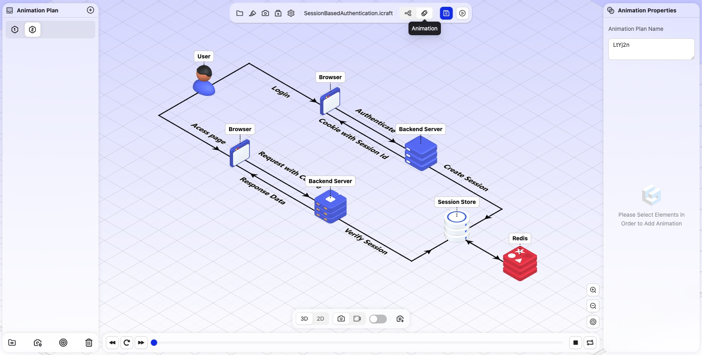
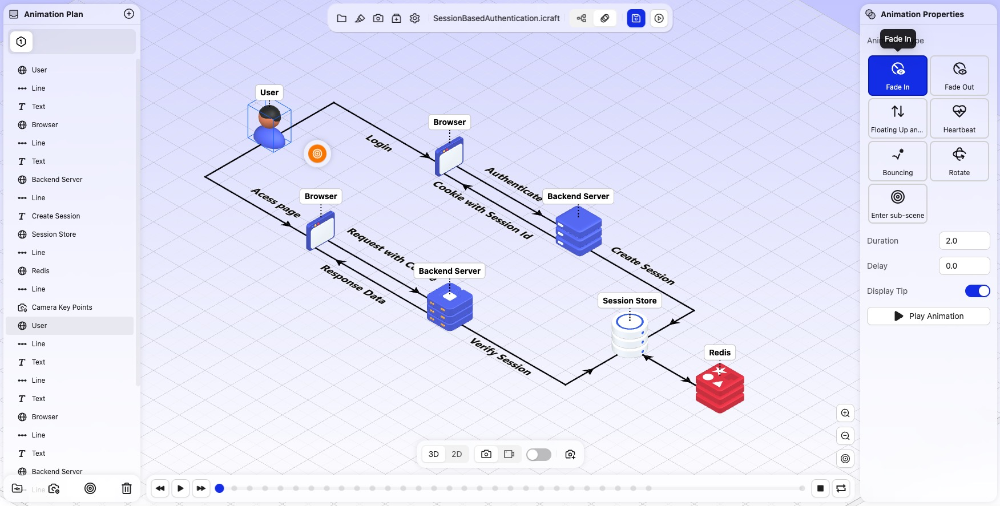
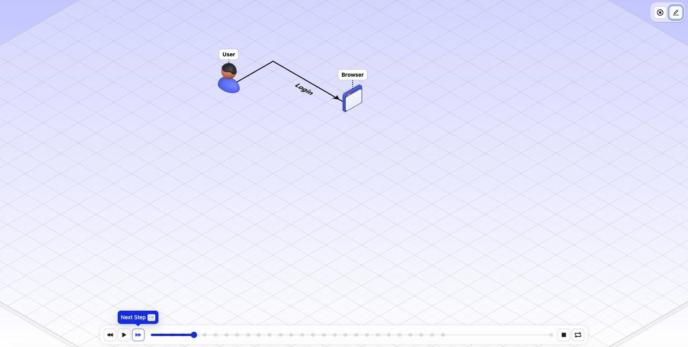

# How to Create an Animatable 3D System Architecture Diagram

Creating an animatable 3D system architecture diagram brings numerous additional benefits and advantages, especially when showcasing, analyzing, and communicating complex systems.

## Benefits of an Animatable System Architecture Diagram

#### 1. Dynamic Display of System Processes and Interactions
Animations can visually represent the interaction flow between different components, such as how requests move between microservices or how data is transmitted within the system. Dynamic displays are more effective than static diagrams in helping users understand the system's operational logic.

#### 2. Real-Time System Status Monitoring
Animations can be integrated with real-time data to display the system's running status, such as the speed of data flow during peak traffic, service response times, and server loads. This provides a visually intuitive way to support operations, monitoring, and system optimization.

#### 3. Fault Detection and Analysis
Through animations, abnormal behaviors or bottlenecks can be clearly illustrated. For instance, when a module crashes or experiences a response delay, animations can dynamically display the module's abnormal status, helping users quickly locate and address the issue.

#### 4. Enhanced Interaction and User Experience
Animations allow users to explore the system architecture interactively. For example, when clicking on a module, an animation can reveal its internal submodules or details, or highlight its dependencies with other modules. This interactive experience is more vivid and intuitive than traditional static diagrams.

#### 5. Display of Time-Based Changes
Animations can show how the system changes over time. For example, it can illustrate the system's transition from startup to a stable state or review the evolution of the system architecture over a specific period, helping users understand the system's lifecycle or historical changes.

#### 6. Simplifying Complex Processes
Animations can break down complex processes step by step, helping users comprehend them gradually. For example, the process from a user request to database storage can be displayed step-by-step through animations, avoiding information overload from presenting everything at once.

#### 7. Enhanced Visual Appeal
Animations provide attractive visual effects, especially during technical presentations or product showcases, helping the audience better understand the system architecture. This not only improves the quality of the presentation but also increases audience attention and interest.

## How to Create an Animatable 3D System Architecture Diagram with iCraft Editor

#### 1. Find the necessary technical components from the left panel and drag them to the appropriate positions.

#### 2. Use lines to connect the components based on their relationships.

#### 3. Add annotation text to describe the functions and purposes of the components. Optionally, enable hover text for elements.

At this point, a static 3D system architecture diagram has been created, but it doesn't yet display dynamic changes.

#### 4. Click the "Animation" toggle button on the toolbar to switch to animation editing mode.

#### 5. You can press the V shortcut to switch to the top view. Based on the desired animation sequence, click on the technical components, lines, and text elements in order. Corresponding animation nodes will be generated in the left panel. The animation sequence follows the node order, which can be adjusted by dragging.

#### 6. In the properties panel of the animation node, you can set the type, duration, and delay of the animation. Here, we use the default animation type for each node: objects and text default to fade-in, and lines default to drawing effects. These settings can be adjusted as needed.

#### 7. In the properties panel of the animation node, click the "Play Animation" button to view the animation effect of that node.

#### 8. To create parallel animations, create a parallel animation folder in the bottom left panel and place the required nodes in it. If you need to switch the viewpoint before a certain animation node, hold Alt + left mouse button to rotate to the appropriate viewpoint. Click "Add Camera Keyframe" to add a camera animation node. When the animation reaches this node, the camera will automatically switch to that viewpoint.

## Demonstrating an Animatable 3D System Architecture Diagram

#### 1. In animation editing mode, click the preview button and then the play button to view the complete animation sequence of the architecture diagram.

#### 2. You can also manually control the playback of each node by clicking the next step button or using the right arrow key → on the keyboard to control each node's playback.

## Recommended: iCraft Editor
Animatable 3D system architecture diagrams not only offer greater visual appeal but also significantly improve the comprehensibility, operability, and expressiveness of system architectures through dynamic demonstrations, real-time monitoring, and interactive displays. They are ideal for showcasing complex system designs, real-time monitoring, technical presentations, and team collaboration, helping different roles like developers, operations teams, and managers efficiently understand and handle system issues.

iCraft Editor Official Website: [https://icraft.gantcloud.com](https://icraft.gantcloud.com)

keywords: system architecture diagram、software architect、IT architecture diagram、network architecture diagram、free architecture software