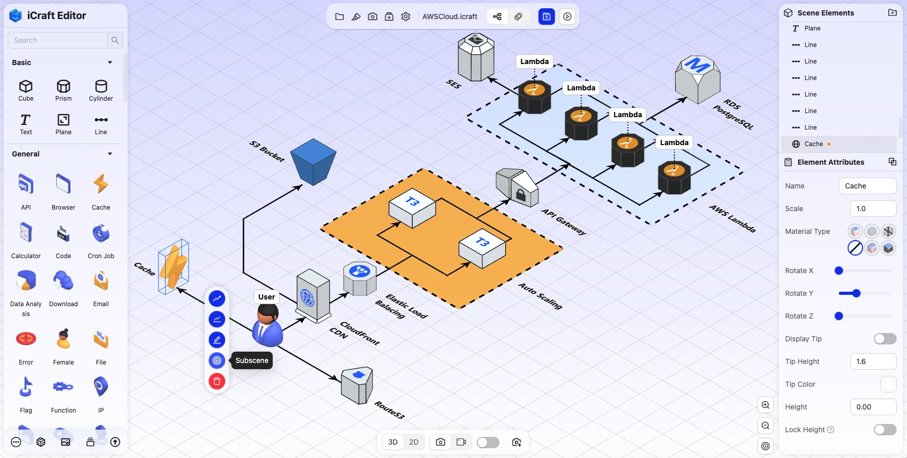
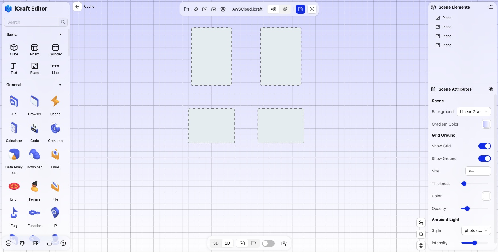
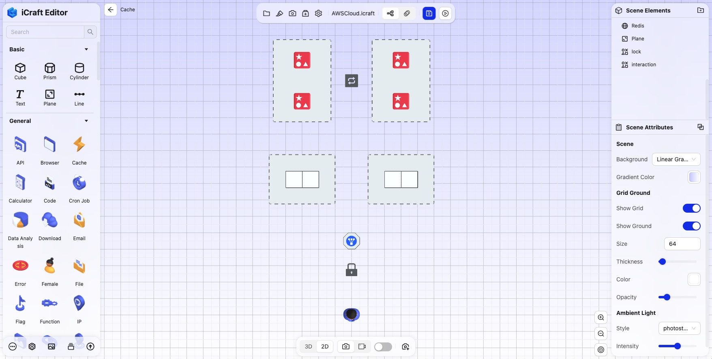
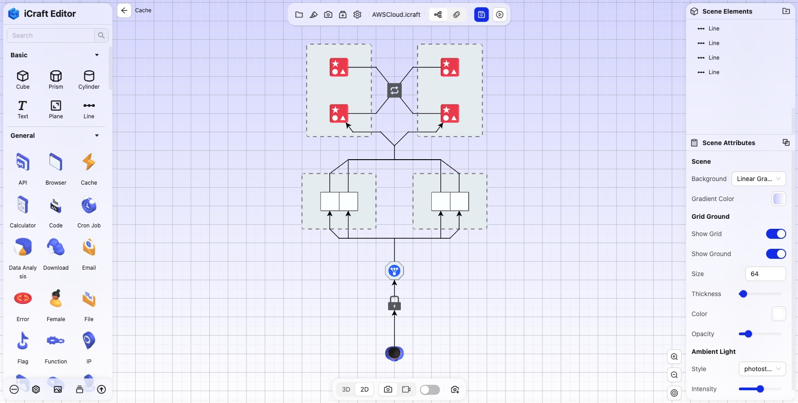

<!--
 * @Descripttion: 
 * @MainAuthor: 
-->

# 如何绘制可以嵌套子场景的3D系统架构图

绘制支持嵌套子场景的3D系统架构图，可以进一步提升系统架构的可视化效果和信息表达能力，特别是在复杂系统或多层次结构的场景中，能够提供更灵活、详细的展示方式。

## 嵌套子场景的架构图优势

1. 分层展示复杂系统

	通过嵌套子场景，可以将复杂系统的各个层级逐层展开展示。例如，在云架构中，可以从高层的整个云环境逐步深入展示虚拟机、容器、服务、数据库等细节。这样分层次的展示，既能简化全局视图，又可以深入查看每个组件的内部结构，避免信息过载。

2. 清晰的模块化视图

	嵌套结构使得系统的模块化设计更加直观。不同的模块可以以子场景的方式嵌套展示，清晰地表现出每个模块的内部组成和与外部的依赖关系，有助于理解系统的分层设计和模块化实现。

3. 灵活的交互体验

	用户可以在3D系统架构中自由切换和探索不同层次的子场景，通过点击、缩放等操作深入到某个子场景，了解其详细信息。相比一张全局的平面图，嵌套子场景能够通过动态展示不同级别的架构，提供更灵活的交互方式和更丰富的信息展示。

4. 信息隐藏与按需展示

	嵌套子场景允许在初始视图中隐藏复杂的细节，仅展示关键的顶层结构。用户可以按需展开和查看某个模块的内部架构。这种信息的按需展示方式可以有效减少信息杂乱，帮助用户聚焦于当前关心的部分，提高理解效率。

5. 支持大规模系统的可视化

	对于大规模系统来说，直接展示全部内容容易造成信息过载。而通过嵌套子场景，系统的不同模块可以分开管理，减少一开始的复杂性，逐步深入查看每个模块的细节，使得大规模架构的可视化更加可行。

6. 方便调试和优化

	嵌套的3D架构图可以帮助开发和运维人员更方便地定位问题。通过对特定子场景的深入查看，团队可以精细化分析系统的某个模块，找到性能瓶颈或系统缺陷，从而更有针对性地进行调试和优化。

## 绘制嵌套子场景的3D系统架构图步骤

##### 1. 打开iCraft Editor软件，新建一个文件或者打开一个之前画好的文件，这里以之前画好的AWS架构图为例。

##### 2. 选取一个元素，从悬浮工具条上点击子场景按钮，可以直接进入这个元素的子场景。

##### 3. 子场景里同样是一个3D场景，可以继续添加元素、调整位置、连线等操作，直到满足子场景的需求，我们可以按快捷键V切换为俯视图后，用平面元素来划分大的区块。

##### 4. 然后根据实际情况，继续添加技术组件，并将它们拖拽放置在子场景的不同位置。

##### 5. 根据元素与元素之间的关系，通过线条连接起来

##### 6. 最后，给技术组件追加解说文字。 

##### 7. 点击左上角返回按钮可以退出子场景，返回到父场景。

## 推荐使用iCraft Editor
使用iCraft Editor可以快速、轻松地绘制嵌套子场景的3D系统架构图, 具备强大的分层展示、信息隐藏、灵活交互等优势，尤其适用于展示大型、复杂的系统架构。它能够帮助用户从全局到细节逐步了解系统的各个层次，提升系统分析、设计和沟通的效率。这种方法特别适合分布式系统、微服务架构、大型网络拓扑以及多平台系统的可视化展示。

iCraft Editor 官网：https://icraft.gantcloud.com